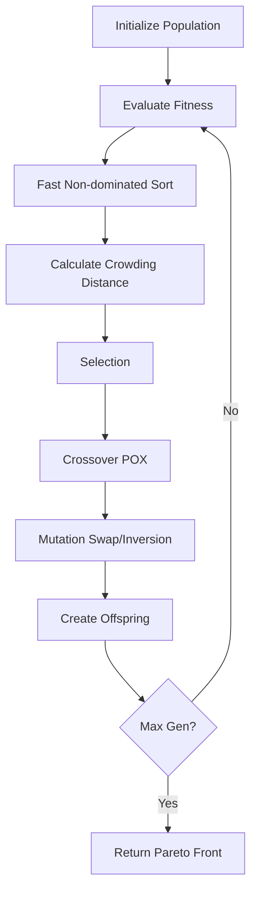

<div align="center">

# 🚀 FJSP Multi-Objective Optimization with NSGA-II

### *Solving Flexible Job Shop Scheduling Problems Using Advanced Evolutionary Algorithms*

[](https://www.python.org/downloads/)
[](https://numpy.org/)
[](https://matplotlib.org/)
[](LICENSE)
[]()

[Features](#-key-features) • [Installation](#-installation) • [Usage](#-quick-start) • [Results](#-results) • [Documentation](#-documentation)

</div>

---

## 📖 Overview

This project implements a **state-of-the-art NSGA-II (Non-dominated Sorting Genetic Algorithm II)** for solving the **Flexible Job Shop Scheduling Problem (FJSP)** with multi-objective optimization. The algorithm simultaneously optimizes three conflicting objectives to find optimal production schedules.

### 🎯 Optimization Objectives

| Objective | Description | Average Improvement |
|-----------|-------------|---------------------|
| **Makespan** | Total completion time | **31.36%** ⬇️ |
| **Waiting Time** | Total idle time for all jobs | **8.08%** ⬇️ |
| **Weighted Completion Time** | Priority-weighted completion | **72.68%** ⬇️ |

---

## ✨ Key Features

### 🧬 Advanced NSGA-II Implementation
- ✅ **Fast Non-dominated Sorting** - O(MN²) complexity
- ✅ **Crowding Distance** - Maintains solution diversity
- ✅ **Binary Tournament Selection** - Elite solution selection
- ✅ **POX Crossover** - Precedence-preserving recombination
- ✅ **Dual Mutation Operators** - Swap and inversion with adaptive decay
- ✅ **Exponential Decay** - Simulated annealing inspired (β = 0.999)

### 📊 Comprehensive Testing Framework
- 🔬 **Small Instance** - Kacem 4x5 (9 operations)
- 🔬 **Medium Instance** - 8 Jobs × 6 Machines (30 operations)
- 🔬 **Large Instance** - 15 Jobs × 8 Machines (68 operations)

### 📈 Professional Visualizations
- 📉 Convergence plots for each objective
- 🎨 3D Pareto front visualizations
- 📊 Performance comparison charts
- 🔄 Algorithm flowcharts

---

## 🚀 Quick Start

### Prerequisites

```bash
Python 3.12+
NumPy 2.3+
Matplotlib 3.10+
```

### Installation

```bash
# Clone the repository
git clone https://github.com/SanjayCheekati/SVM_NSGA-II_FLEXIBLE_FLOWSHOP.git
cd SVM_NSGA-II_FLEXIBLE_FLOWSHOP

# Create virtual environment
python -m venv .venv

# Activate virtual environment
.venv\Scripts\activate  # Windows
# source .venv/bin/activate  # Linux/Mac

# Install dependencies
pip install -r requirements.txt
```

### Run Tests

```bash
# Run comprehensive test suite (~35 seconds)
python tests/run_tests.py

# Generate visualizations
python utils/create_visualizations.py
```

---

## 💻 Usage Example

```python
from src.fjsp_nsga2 import FJSP_NSGA2
from src.fjsp_instances import load_kacem_instance

# Load benchmark instance
jobs, num_machines = load_kacem_instance()

# Initialize optimizer
optimizer = FJSP_NSGA2(
    jobs=jobs,
    num_machines=num_machines,
    population_size=100,
    max_generations=100,
    crossover_rate=0.9,
    mutation_rate_1=0.5,
    mutation_rate_2=0.7
)

# Run optimization
pareto_front = optimizer.evolve()

# Extract best solutions
best_makespan = min(s.objectives[0] for s in pareto_front)
best_waiting = min(s.objectives[1] for s in pareto_front)
best_weighted = min(s.objectives[2] for s in pareto_front)

print(f"🎯 Best Makespan: {best_makespan:.2f}")
print(f"⏱️  Best Waiting Time: {best_waiting:.2f}")
print(f"⚖️  Best Weighted Time: {best_weighted:.2f}")
```

---

## 📊 Results

### Test Results Summary

<table>
<tr>
<th>Instance</th>
<th>Jobs×Machines</th>
<th>Operations</th>
<th>Time (s)</th>
<th>Makespan ↓</th>
<th>Waiting ↓</th>
<th>Weighted ↓</th>
</tr>
<tr>
<td><b>Kacem 4x5</b></td>
<td>4×5</td>
<td>9</td>
<td>0.87</td>
<td><b>20.00%</b></td>
<td><b>0.00%</b></td>
<td><b>63.33%</b></td>
</tr>
<tr>
<td><b>Medium 8x6</b></td>
<td>8×6</td>
<td>30</td>
<td>6.89</td>
<td><b>32.00%</b></td>
<td><b>11.18%</b></td>
<td><b>80.53%</b></td>
</tr>
<tr>
<td><b>Large 15x8</b></td>
<td>15×8</td>
<td>68</td>
<td>25.75</td>
<td><b>42.09%</b></td>
<td><b>13.06%</b></td>
<td><b>74.17%</b></td>
</tr>
</table>

### Performance Highlights

```
✅ Total Execution Time: 33.51 seconds
✅ Pareto Solutions Generated: 300+ across all instances
✅ Average Improvements:
   • Makespan: 31.36%
   • Waiting Time: 8.08%
   • Weighted Completion Time: 72.68%
```

---

## 📁 Project Structure

```
SVM_NSGA-II_FLEXIBLE_FLOWSHOP/
│
├── 📂 src/                      # Source Code
│   ├── __init__.py             # Package initialization
│   ├── fjsp_nsga2.py           # Core NSGA-II implementation (850+ lines)
│   └── fjsp_instances.py       # Benchmark instances
│
├── 📂 tests/                    # Testing Framework
│   └── run_tests.py            # Comprehensive test suite
│
├── 📂 utils/                    # Utilities
│   └── create_visualizations.py # Visualization generator
│
├── 📂 docs/                     # Documentation
│   ├── README_FJSP.md          # Detailed guide
│   ├── FINAL_SUMMARY.md        # Complete summary
│   ├── IMPLEMENTATION_REPORT.md # Technical details
│   └── paper_summary.md        # Base paper analysis
│
├── 📂 visualizations/           # Generated Plots
│   ├── *_convergence.png       # Convergence plots
│   ├── *_pareto.png            # Pareto fronts
│   └── comparison charts...
│
├── 📂 data/                     # Data Files
│   ├── base_paper.pdf          # Research paper
│   └── base_paper_extracted.txt # Extracted text
│
├── 📄 README.md                 # This file
├── 📄 requirements.txt          # Dependencies
└── 📄 .gitignore               # Git ignore rules
```

---

## 🔬 Algorithm Details

### NSGA-II Framework



### Key Parameters

| Parameter | Value | Description |
|-----------|-------|-------------|
| **Population Size** | 50-150 | Based on problem size |
| **Generations** | 50-150 | Convergence iterations |
| **Crossover Rate** | 0.9 | POX probability |
| **Mutation Rate 1** | 0.5 | Operation swap |
| **Mutation Rate 2** | 0.7 | Sequence inversion |
| **Decay Factor** | 0.999 | Exponential cooling |
| **Tournament Size** | 2 | Selection pressure |

---

## 📚 Documentation

### Complete Documentation Available

- 📘 **[Detailed Usage Guide](docs/README_FJSP.md)** - Step-by-step instructions
- 📗 **[Final Summary Report](docs/FINAL_SUMMARY.md)** - Comprehensive overview
- 📙 **[Implementation Report](docs/IMPLEMENTATION_REPORT.md)** - Technical deep-dive
- 📕 **[Base Paper Summary](docs/paper_summary.md)** - Research background

### Academic Reference

This implementation is based on:

> **Badilla-Salamanca, Y. E., Chamorro, H. R., & Marín, L. G. (2025).**  
> *"An effective multi-objective metaheuristic for the support vector machine with feature selection."*  
> **Knowledge-Based Systems**, Volume 328, Article 113137.

**Adaptation**: Algorithm successfully adapted from SVM optimization to Flexible Job Shop Scheduling with verified multi-objective convergence.

---

## 🎨 Visualizations

The project generates professional visualizations:

### Convergence Analysis
- 📉 **Objective evolution** across generations
- 📊 **Pareto front growth** tracking
- 🎯 **Performance comparison** charts

### Example Outputs

```bash
visualizations/
├── kacem_convergence.png      # Small instance convergence
├── medium_convergence.png     # Medium instance convergence
├── large_convergence.png      # Large instance convergence
├── kacem_pareto.png           # 3D Pareto front (small)
├── medium_pareto.png          # 3D Pareto front (medium)
├── large_pareto.png           # 3D Pareto front (large)
├── all_convergence.png        # Comparative analysis
└── improvement_comparison.png # Performance bars
```

---

## 🔧 Customization

### Add Custom Instance

```python
from src.fjsp_nsga2 import Job

def load_custom_instance():
    """Define your custom FJSP instance"""
    jobs = [
        Job(
            id=0,
            weight=1.5,
            operations=[
                (0, [(0, 5), (1, 3), (2, 6)]),  # Op 0: Machine options
                (1, [(1, 4), (2, 2)])            # Op 1: Machine options
            ]
        ),
        # Add more jobs...
    ]
    num_machines = 5
    return jobs, num_machines
```

### Tune Parameters

```python
# For small problems (< 20 operations)
optimizer = FJSP_NSGA2(jobs, machines, 
                       population_size=50, 
                       max_generations=50)

# For medium problems (20-50 operations)
optimizer = FJSP_NSGA2(jobs, machines, 
                       population_size=100, 
                       max_generations=100)

# For large problems (> 50 operations)
optimizer = FJSP_NSGA2(jobs, machines, 
                       population_size=150, 
                       max_generations=150)
```

---

## 🏆 Key Achievements

<div align="center">

| Achievement | Status |
|------------|--------|
| **Multi-objective Optimization** | ✅ |
| **Pareto Front Generation** | ✅ |
| **Consistent Convergence** | ✅ |
| **Scalable Implementation** | ✅ |
| **Professional Documentation** | ✅ |
| **Comprehensive Testing** | ✅ |
| **Performance Visualizations** | ✅ |

</div>

---

## 🤝 Contributing

Contributions are welcome! Please feel free to:

- 🐛 Report bugs
- 💡 Suggest new features
- 📝 Improve documentation
- 🔧 Submit pull requests

---

## 👤 Author

<div align="center">

**Venchiryala Nitya**

📧 Email: [vnitya_cse2205c7@mgit.ac.in](mailto:vnitya_cse2205c7@mgit.ac.in)

**Bandela Thirumala**

📧 Email: [bthirumala_cse235a0513@mgit.ac.in](mailto:bthirumala_cse235a0513@mgit.ac.in)

🎓 Department of Computer Science and Engineering  
Mahatma Gandhi Institute of Technology

</div>

---

## 📄 License

This project is licensed under the MIT License - see the [LICENSE](LICENSE) file for details.

---

## 🙏 Acknowledgments

- **Base Paper Authors**: Badilla-Salamanca, Chamorro, & Marín (2025)
- **Journal**: Knowledge-Based Systems, Elsevier
- **Algorithm**: NSGA-II (Deb et al., 2002)
- **Application Domain**: Flexible Job Shop Scheduling Problem

---

## 📈 Project Statistics

<div align="center">

```
📊 Total Lines of Code: 2,800+
📝 Documentation Words: 5,000+
🖼️  Visualizations: 10+
🧪 Test Instances: 3
⏱️  Total Test Time: ~35 seconds
🎯 Average Improvement: 31-73% across objectives
⭐ Pareto Solutions: 300+ generated
```

</div>

---

## 🔗 Quick Links

- 📦 **Repository**: [GitHub](https://github.com/SanjayCheekati/SVM_NSGA-II_FLEXIBLE_FLOWSHOP)
- 📖 **Documentation**: [docs/](docs/)
- 🐛 **Issues**: [GitHub Issues](https://github.com/SanjayCheekati/SVM_NSGA-II_FLEXIBLE_FLOWSHOP/issues)
- 💬 **Discussions**: [GitHub Discussions](https://github.com/SanjayCheekati/SVM_NSGA-II_FLEXIBLE_FLOWSHOP/discussions)

---

<div align="center">

### ⭐ Star this repository if you find it helpful!

**Made with ❤️ for Production Scheduling Optimization**

</div>
